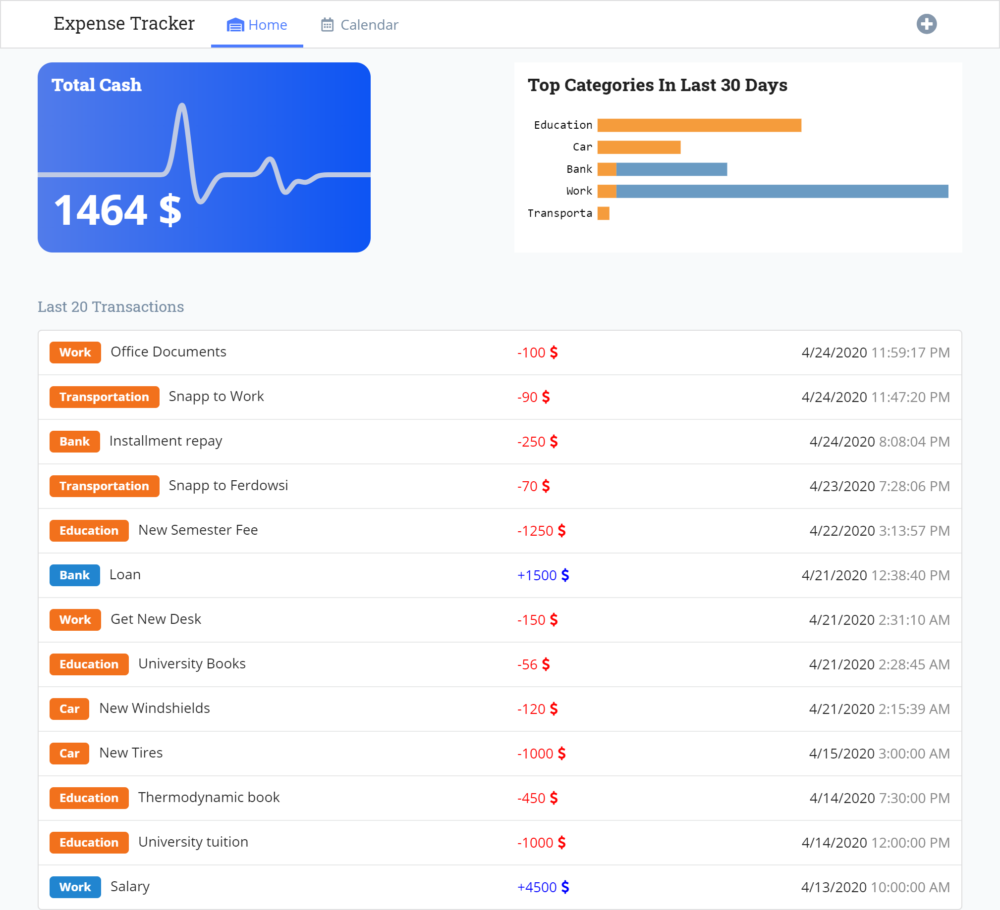
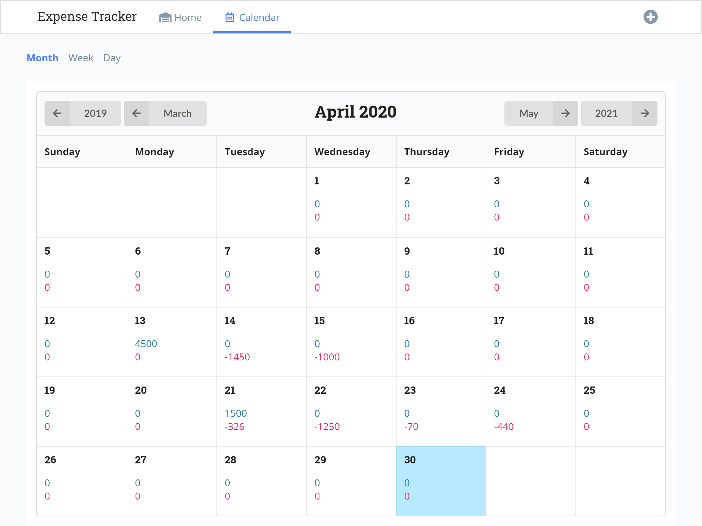
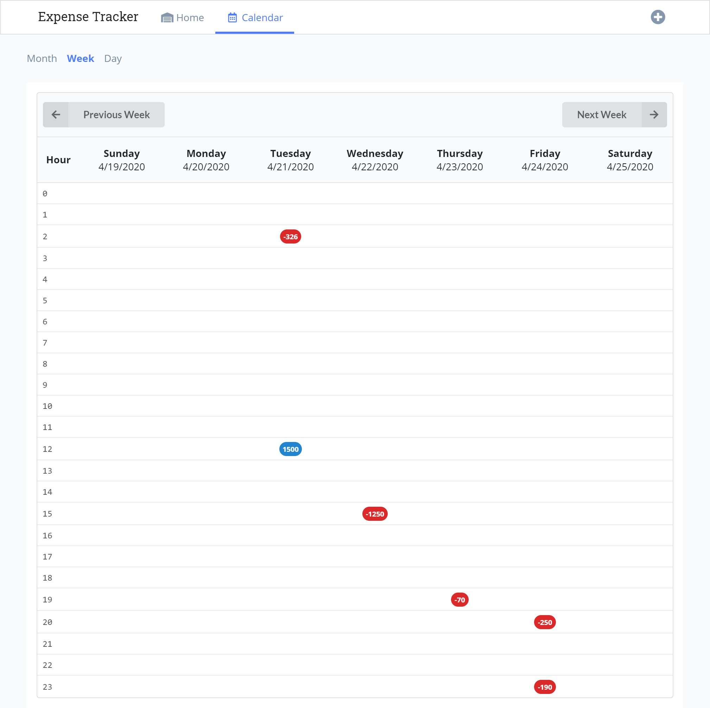
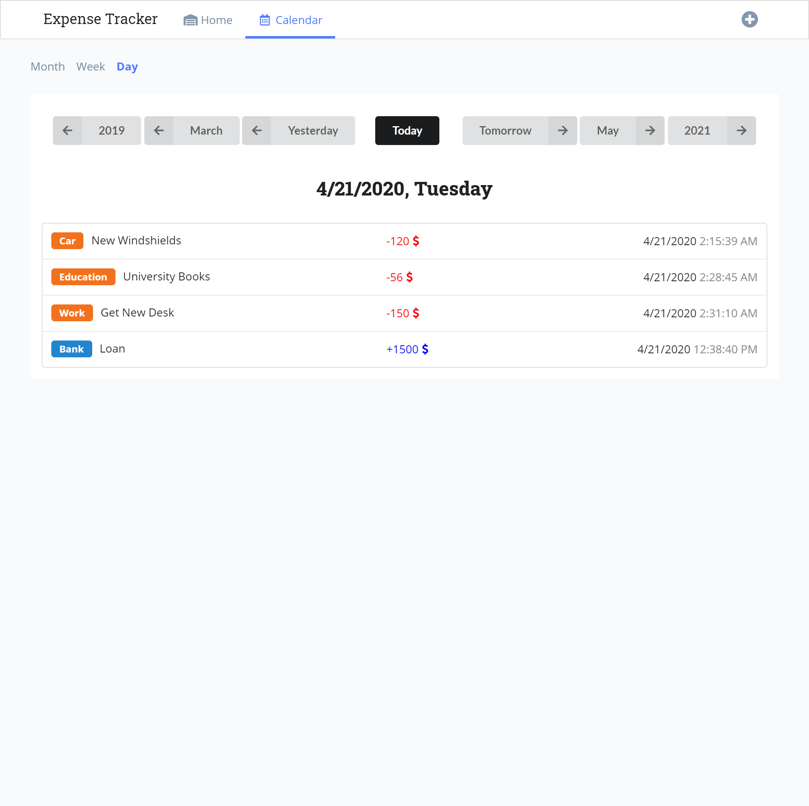
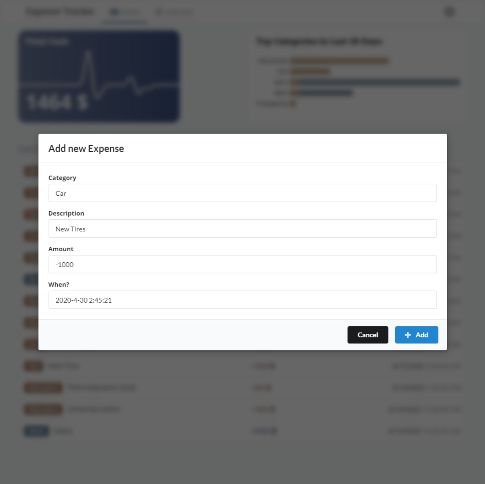

# Expense Tracker

I wrote this app when I was learning react. 

### Notes:

 - the charts are demonstrated with d3js
 - app is a single page without reloading (react-reouter-dom)
 - elements are based on semantic-ui framwork (semantic-ui-react)
 - the back-end is on [expense_tracker_backend](http://github.com/akrami/expense_tracker_backend) and written on nodejs, express and saved on mongodb.

### Screenshots:

Home Page:

Here you can see two charts, the first one is remained amount of money with a line chart for last 30 days on the background.

The other one is top 5 categories with most expenses during last 30 days.

You can also see last 20 expenses on the third section.

Calendar Month View:

Calendar Week View:

Calendar Day View:

Add New Expense:

